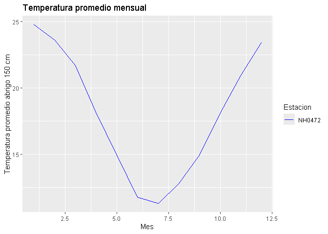

<!-- README.md is generated from README.Rmd. Please edit that file -->

# meteorologia

<!-- badges: start -->

[](https://lifecycle.r-lib.org/articles/stages.html#experimental)
[](https://github.com/lizmartinez-droid/meteorologia/actions/workflows/R-CMD-check.yaml)
[](https://app.codecov.io/gh/lizmartinez-droid/meteorologia)
<!-- badges: end -->

El objetivo de este paquete es analizar datos de estaciones
meteorologicas, resumiendo y presentadolos.

## Instalación

Podes instalar el paquete en [GitHub](https://github.com/) con:

``` r
# install.packages("pak")
# pak::pak("lizmartinez-droid/meteorologia")
```

## Carga paquete

Se debe cargar el paquete con el siguente código.

``` r
library(meteorologia)
```

## Funciones

El paquete incluye tres funciones:

leer_datos_estacion() Descarga y lee los datos meteorológicos de una
estación específica del INTA.

``` r
 estacion1 <- leer_datos_estacion("NH0472", "NH0472.csv")
#> El archivo ya esta descargado, se procede a leerlo...
#> Lectura completada correctamente para la estacion NH0472.
```

tabla_resumen_temperatura() Crea una tabla resumen con estadísticas
básicas de temperatura (promedio, desvío, máximos y mínimos).

``` r
tabla_resumen_temperatura(estacion1)
#> # A tibble: 1 × 5
#>   id     promedio_temperatura desvio_estandar temp_max temp_min
#>   <chr>                 <dbl>           <dbl>    <dbl>    <dbl>
#> 1 NH0472                 18.0            5.94     42.1       -8
```

grafico_temperatura_mensual() Genera un gráfico de líneas con la
temperatura promedio mensual de una o varias estaciones.

``` r
grafico_temperatura_mensual(estacion1, c("blue"), "Temperatura promedio mensual")
```



## Créditos

Datos meteorológicos obtenidos del Instituto Nacional de Tecnología
Agropecuaria (INTA) – Sistema de Información y Gestión Agropecuaria
(SIGA).

## Licencia

Este paquete se distribuye bajo la licencia [MIT](LICENSE.md).

### Autor del paquete: Liz Martinez
